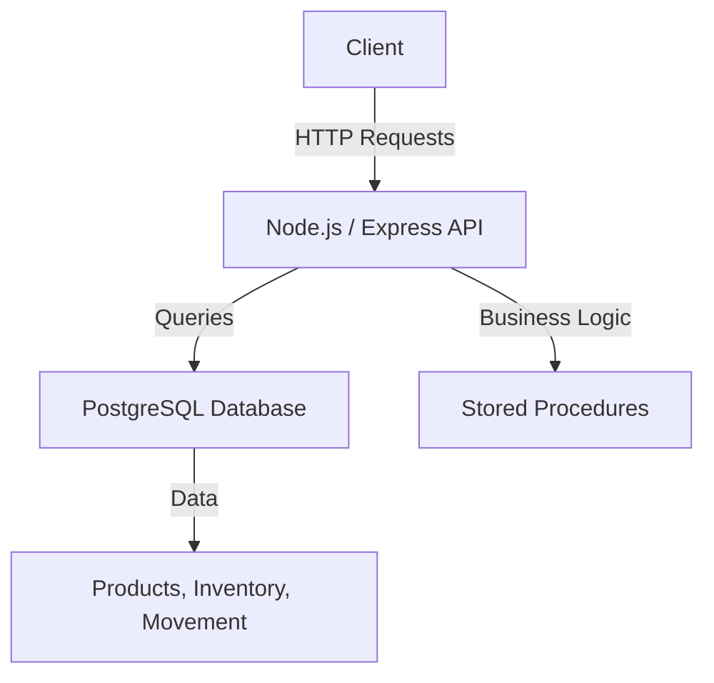

# API Documentation

## Descripción
Esta API fue desarrollada utilizando **Node.js**, **Express**, y **PostgreSQL**. Su propósito es gestionar productos, inventarios y movimientos de productos entre tiendas.

## Instrucciones de Instalación

### Requisitos Previos
1. **Node.js**: Instale Node.js desde [Node.js Official Website](https://nodejs.org/).
2. **PostgreSQL**: Instale PostgreSQL desde [PostgreSQL Official Website](https://www.postgresql.org/).
3. **Git**: Asegúrese de tener Git instalado para clonar el repositorio.

### Pasos para la Instalación
1. Clone el repositorio:
   ```bash
   git clone https://github.com/tu_usuario/tu_repositorio.git
   cd tu_repositorio
   ```
2. Instale las dependencias:
   ```bash
   npm install
   ```
3. Configure las variables de entorno:
   Cree un archivo `.env` en la raíz del proyecto y configure las siguientes variables:
   ```env
   DB_HOST=localhost
   DB_PORT=5432
   DB_USER=tu_usuario
   DB_PASSWORD=tu_contraseña
   DB_NAME=nombre_base_datos
   PORT=3000
   ```
4. Cree la base de datos y las tablas necesarias:
   Ejecute los scripts de creación de tablas y procedimientos almacenados proporcionados en el archivo `database/init.sql`.

5. Inicie el servidor:
   ```bash
   npm start
   ```
   El servidor estará disponible en [http://localhost:3000](http://localhost:3000).

---

## Documentación de la API

### Endpoints

#### Productos
- **GET** `/api/products`
  - Descripción: Obtiene todos los productos con filtros opcionales.
  - Parámetros opcionales:
    - `category`: Filtra por categoría.
    - `minPrice`: Precio mínimo.
    - `maxPrice`: Precio máximo.
  - Respuesta:
    ```json
    [
      {
        "productsId": 1,
        "productsName": "Laptop",
        "productCategory": "Electronics",
        "productPrice": 1200.99
      }
    ]
    ```

- **POST** `/api/products`
  - Descripción: Crea un nuevo producto.
  - Cuerpo de solicitud:
    ```json
    {
      "productsName": "Laptop",
      "productDesc": "Laptop de alta gama",
      "productCategory": "Electronics",
      "productPrice": 1500.50,
      "productSku": "ABC123"
    }
    ```

- **PUT** `/api/products/:id`
  - Descripción: Actualiza un producto existente.
  - Cuerpo de solicitud:
    ```json
    {
      "productsName": "Tablet",
      "productDesc": "Tablet actualizada",
      "productCategory": "Electronics",
      "productPrice": 800.99,
      "productSku": "DEF456"
    }
    ```

- **DELETE** `/api/products/:id`
  - Descripción: Elimina un producto existente.

#### Inventario
- **GET** `/api/inventory/:storeId`
  - Descripción: Obtiene el inventario de una tienda.

- **POST** `/api/inventory/transfer`
  - Descripción: Transfiere productos entre tiendas.
  - Cuerpo de solicitud:
    ```json
    {
      "productsId": "123",
      "sourceStoreId": "STORE001",
      "targetStoreId": "STORE002",
      "quantity": 10
    }
    ```

- **GET** `/api/alerts/low-stock`
  - Descripción: Obtiene productos con bajo stock.

---

## Decisiones Técnicas

1. **Base de datos PostgreSQL**:
   - Elegida por su robustez, soporte a procedimientos almacenados y capacidad para manejar relaciones complejas.

2. **Express**:
   - Framework minimalista para Node.js que facilita la creación de APIs RESTful.

3. **Procedimientos almacenados**:
   - Se optó por mover la lógica de negocio crítica a la base de datos para mejorar el rendimiento y garantizar la consistencia de los datos.

4. **Gestión de errores**:
   - Errores SQL se manejan utilizando `SIGNAL` en PostgreSQL y son convertidos a respuestas HTTP con códigos específicos.

5. **Arquitectura modular**:
   - Cada recurso (productos, inventarios, movimientos) tiene rutas y controladores separados para facilitar el mantenimiento y escalabilidad.

---

## Diagrama de Arquitectura



---

## Contribuciones
Las contribuciones son bienvenidas. Por favor, abra un pull request o informe problemas en el repositorio.

---

## Licencia
Este proyecto está bajo la Licencia MIT. Consulte el archivo `LICENSE` para más detalles.


Las contribuciones son bienvenidas. Por favor, abra un pull request o informe problemas en el repositorio.

Licencia

Este proyecto está bajo la Licencia MIT. Consulte el archivo LICENSE para más detalles.
